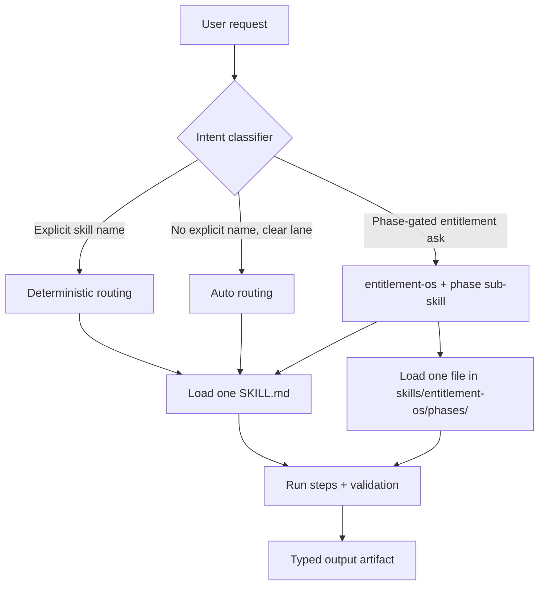

# Skills + Shell + Compaction Architecture

Last reviewed: 2026-03-04

## Overview

This repository adopts a production pattern for long-running agents built on three Responses API primitives:

- Skills: on-demand instruction bundles in `skills/`
- Shell: hosted container execution for compute-heavy tasks
- Server-side compaction: context compaction + response chaining for long workflows

This pattern is used to reduce token overhead, keep procedures modular, and preserve continuity across multi-phase runs.

Canonical external reference:
- https://openai.com/index/new-tools-for-building-agents/

## Why This Was Adopted

Before this architecture:
- `AGENTS.md` (~24 KB) was frequently loaded on each interaction.
- Entitlement prompt docs (~33 KB combined) were repeatedly loaded for long-horizon work.
- Long phase chains risked context blowup and brittle handoffs.

After this architecture:
- `AGENTS.md` stays the global policy contract.
- Domain instructions are loaded on demand from `skills/*`.
- Compaction and `previous_response_id` chaining reduce repeated prompt replay.

## Token Cost Analysis

Approximation method: tokens ~= characters / 4.

| Scenario | Approx loaded chars | Approx tokens | Notes |
|---|---:|---:|---|
| Before: global + entitlement docs loaded repeatedly | 57,000+ | 14,250+ | 24 KB + 33 KB baseline before task-specific context |
| After: global policy + one matched skill | 24,000 + skill-specific | materially lower | Unused skills cost zero tokens |
| After (long runs): chained with compaction | lower effective context growth | materially lower | Prior turns compacted server-side |

The exact savings vary by lane and run length, but the main shift is from always-loaded monoliths to demand-loaded lane modules.

## Skill Routing Flow



ASCII view:

```text
User -> Intent route -> one primary skill
                     -> (if entitlement) one phase sub-skill
                     -> execute steps
                     -> validate output
                     -> return typed result/artifact
```

## Skill Contract

Each skill is stored at `skills/<name>/SKILL.md` and follows this structure:

```markdown
***
name: <kebab-case-skill-name>
version: "1.0"
description: |
  Use when: <routing criteria>
  Don't use when: <negative routing criteria>
  Outputs: <artifact/result contract>
***

## Prerequisites
...

## Steps
1. ...

## Validation
...

## Examples
### Good input -> expected output
...

### Bad input -> expected routing
...
```

Authoring rules:
- Include at least one positive and one negative routing example.
- Do not include secrets, credentials, or internal-only URLs.
- Define explicit validation checks and fail conditions.
- Bump `version` whenever behavior/routing/output contract changes.

## Adding a New Skill

1. Create `skills/<new-skill>/SKILL.md` using the standard contract.
2. Define precise `Use when`, `Don't use when`, and `Outputs` clauses.
3. Add concrete numbered steps and validation checks.
4. Add positive and negative routing examples.
5. Add references in `skills/README.md`.
6. If routing/policy changes, update:
   - `AGENTS.md` section 17
   - `CLAUDE.md` skill section
   - relevant `.cursor/rules/*.mdc`

## Modifying an Existing Skill

1. Update the procedure, routing, or validation text.
2. Re-check negative routing examples to prevent lane drift.
3. Bump `version` in frontmatter.
4. Verify cross-references use exact skill names.
5. Re-run lint/typecheck/test/build if code changes are included with the skill update.

## Shell Execution Pattern

Shell wrapper location:
- `packages/openai/src/shell.ts`

Network policy definitions:
- `packages/openai/src/network-policies.ts`

Workflow modules:
- `packages/openai/src/shell-workflows/underwriting-workflow.ts`
- `packages/openai/src/shell-workflows/market-analysis-workflow.ts`
- `packages/openai/src/shell-workflows/data-extraction-workflow.ts`

Required shell rules:
- Deny-all network policy by default.
- Per-workflow allowlists (least privilege).
- Secrets only via `domain_secrets` env indirection.
- Write artifacts to shell filesystem paths and return typed metadata.

## Network Policy Reference

| Policy | Allowlist | Secret Mapping |
|---|---|---|
| `DENY_ALL` | `[]` | none |
| `LOCAL_GATEWAY` | `api.gallagherpropco.com`, `tiles.gallagherpropco.com` | `GATEWAY_KEY <- env:LOCAL_API_KEY` |
| `QDRANT_ONLY` | `qdrant.gallagherpropco.com` | `QDRANT_API_KEY <- env:QDRANT_API_KEY` |
| `OPENAI_ONLY` | `api.openai.com` | `OPENAI_API_KEY <- env:OPENAI_API_KEY` |
| `CRITICAL_CLOUD_APIS` | `api.gallagherpropco.com`, `tiles.gallagherpropco.com`, `qdrant.gallagherpropco.com` | `GATEWAY_KEY <- env:LOCAL_API_KEY`, `QDRANT_API_KEY <- env:QDRANT_API_KEY` |

## Compaction Behavior

Core wrapper:
- `packages/openai/src/responses.ts`

Behavior:
- Compaction defaults to enabled.
- Strategy supports `auto` and `manual`.
- Calls accept `previous_response_id` for chaining.
- Wrapper returns `response_id` / `responseId` for caller continuity.

## Temporal Chaining

Worker continuity wiring is stored in workflow state so each step can pass prior context:
- `apps/worker/src/workflows/agentRun.ts`
- `apps/worker/src/workflows/dealIntake.ts`
- `apps/worker/src/workflows/parishPackRefresh.ts`
- `apps/worker/src/workflows/triage.ts`
- `apps/worker/src/activities/openai.ts`

Rule:
- After each AI step, persist latest `response_id` in workflow state and use it as `previous_response_id` on the next step.
- This keeps long phase sequences replay-safe and prevents context reset between steps.
